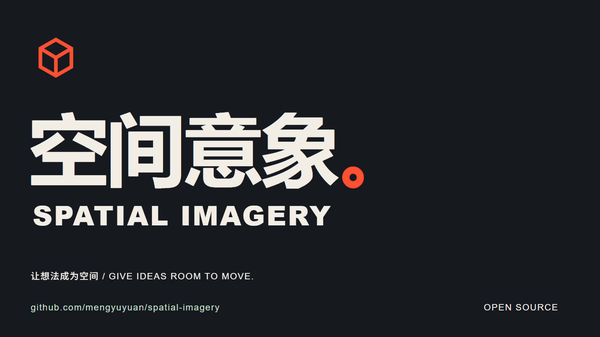

# 空间意象 · Spatial Imagery

**让想法成为空间。** 面向主体驱动叙事的 TypeScript SDK：连续运动、空间镜头接力、声音包络，以及可追溯的设计表。

[English](README.md) · [完整制作管线](docs/pipeline.zh-CN.md) · [API](docs/api.md) · [宣传片源码](examples/launch-film/README.md)

[](media/spatial-imagery-kinetic-v2.mp4)

**当前为 v0.1.0 早期版本。** 我们把视频返修中形成的方法写成确定性函数和明确记录。SDK 不会自动替你完成审美判断、转录、抠像或真人重打光，也不宣称输入一句话就能得到专业成片；这些仍按制作管线完成。

## 已封装的能力

| 模块 | 实际提供 |
|---|---|
| 运动 | 按绝对秒采样的数值轨道、三次 Hermite 空间轨迹与解析速度 |
| 镜头 | 跟随主体、前视、透视投影、切点屏幕位置/速度/尺度诊断 |
| 声音 | 可闻锚点对齐、运动力度、淡入淡出、材质等功率交叉淡化、声像、音频采样级增益 |
| 设计表 | A/B/全屏状态、主体状态链、镜头任务、声音意图、阅读窗口、交接记录与 JSON 校验 |
| 素材与样片库 | 原素材与样片版本分开检索，来源/哈希/许可记录，认可绑定具体版本与范围 |
| 检查 | 独立 Node 入口验证文件哈希、项目路径边界、实际解码帧数及音视频时长 |
| 宣传片 | 30 秒中英双语示例；SDK 输出镜头和运动数据，Blender 渲染，Remotion 合成，现成音效混音 |

核心包没有运行时依赖。Blender、Remotion 等渲染器单独安装。

## 从源码运行

需要 Node.js 22+。首版通过源码或本地打包安装，**尚未发布到 npm**。

```sh
git clone https://github.com/mengyuyuan/spatial-imagery.git
cd spatial-imagery
npm ci
npm test
node dist/cli.js init ./my-film
node dist/cli.js check ./my-film/storyboard.json
npm pack
```

PR 尚未合并时，切换到该 PR 的功能分支查看完整代码。生成的 `spatial-imagery-0.1.0.tgz` 可安装到其他项目；不要直接假定 npm 同名包属于本仓库。

```ts
import {motionPath, followCamera, sampleCue} from 'spatial-imagery';

const subject = motionPath([
  {time: 0, position: [0, 0, 0]},
  {time: 2, position: [0, 6, 1], velocity: [0, 3, 0]},
  {time: 4, position: [1, 12, 1]},
]);
const time = frame / fps;
const object = subject(time);
const camera = followCamera(subject, time, {
  offset: [0, -5, 2], lookAhead: 0.12, fov: 45,
});
const sound = sampleCue({
  id: 'SFX01', asset: 'licensed-air.wav', start: 0, end: 4,
  sourceIn: 0.5, fadeIn: 0.3, fadeOut: 0.6, gainDb: -12,
  pan: [-0.2, 0.2],
}, time);
```

把位置、镜头和增益交给你的渲染器/混音器即可。支持任意顺序拖轴与分帧渲染；不依赖上一帧累积状态。坐标由调用方约定，示例使用 Z 向上，视角为垂直角度。更详细的参数和边界见 [API](docs/api.md)。

## 制作方法

先理解内容，再确定主体；写出观众实际看到的变化，安排镜头发现顺序；主动寻找视频和声音素材，用同一时间轴编排；渲染后审看、听审，把真实版本回库。完整步骤、设计表字段、音效检索处理和检查方法见[制作管线](docs/pipeline.zh-CN.md)。结构校验通过不等于设计、许可或听感通过。

宣传片附[设计表](examples/launch-film/design.md)、[素材身份](examples/launch-film/asset-manifest.json)、[复现说明](examples/launch-film/README.md)和 [QA](examples/launch-film/qa.json)。示例里的材质、造型和配色属于这支片子，下一支片子按内容设计。

原始代码采用 **MIT**；制作方法文档采用 **CC BY 4.0**。第三方媒体和渲染器单独遵守各自许可，详见 [NOTICE](NOTICE.md)。公开包不含个人原片、付费音库或凭据。
